<div align="center">
  
</div>

<div align="center">

[](https://readme-typing-svg.herokuapp.com)

<br/>

[](https://www.linkedin.com/in/m-subhan/)
[](https://www.credly.com/users/muhammad-subhan-ud-din/badges)
[](mailto:muhammadsubhan221b@gmail.com)
[](https://github.com/m-subhaan)

</div>

---

### What I do

SAP BTP developer and full-stack engineer with **5+ years** owning production systems end to end. At **FAIR Consulting Group** (Sydney, remote) I deliver S/4HANA, BTP and Commerce Cloud programmes for enterprise clients across Australia and New Zealand.

Almost all of my current delivery sits on BTP — SAP Joule Skills, CAP, Build Process Automation, Integration Suite (CPI) and S/4HANA Cloud APIs. I delivered an early production rollout of SAP Joule Skills at a big-four advisory firm, shipped BPA automations retiring hundreds of manual steps, and am modernising a legacy on-premise ESB onto Integration Suite.

A full-stack and AWS foundation (React, Node.js, TypeScript, PostgreSQL, AWS CDK) underpins the extension, middleware and UI layers around the SAP core.

---

## ⚡ Production Impact

<div align="center">

| What shipped | The numbers |
|:---|:---|
| 🤖 **SAP Joule Skills — McGrathNicol** | Finance transactions cut from **5–7 min → under 30 seconds** |
| 📧 **SAP BPA automation — Spicers** | Retired a **400-step manual process** — hours per file → minutes |
| ☁️ **Infrastructure as code — Northbay** | **35% faster** deployments · **20% more frequent** releases |
| ✈️ **Real-time IoT platform — KKIA** | Baggage sensor streaming at **King Khalid International Airport**, Riyadh |
| 👥 **Engineering team lead — Officeworks** | Architecture, standards & code review for **3 developers** |
| 🌏 **Enterprise reach** | Production systems serving clients across **Australia & New Zealand** |

</div>

---

## 🔬 Currently Building

```python
# FAIR Consulting Group · McGrathNicol engagement · 2025–present
currently_shipping = {
    "project":  "SAP Joule Skills — NL-driven S/4HANA Finance Operations",
    "platform": "SAP BTP · Joule Studio · Cloud Foundry · XSUAA",
    "stack":    ["Node.js", "SAP CAP", "S/4HANA Cloud APIs", "RBAC", "CI/CD"],
    "impact":   "common finance transactions: 5–7 min → < 30 seconds",
    "skills":   ["invoice creation/cancellation", "accrual raise/release",
                 "time & expense invoices", "project resource management"],
}

# Open-source side projects
also_building = [
    "mcp-gmail       — Model Context Protocol server for Gmail",
    "mcp-quickbooks  — MCP server bridging LLMs to QuickBooks APIs",
    "SmartAssistant  — conversational AI tooling layer",
]
```

---

## 🛠 Stack

<div align="center">

**Languages**

[](https://skillicons.dev)

**SAP BTP &nbsp;·&nbsp; Primary Platform**


**Frontend**

[](https://skillicons.dev)

**Backend & APIs**

[](https://skillicons.dev)

**Databases**

[](https://skillicons.dev)

**Cloud & DevOps**

[](https://skillicons.dev)

**Developer Tooling**


</div>

---

## 🔷 SAP BTP Depth

<div align="center">

| Service / Tool | What I've built with it |
|:---|:---|
| **SAP Joule & Joule Studio** | Shipped production skills at McGrathNicol: invoice creation/cancellation, accrual raise/release, time & expense invoices, project resource management — all via natural language on S/4HANA Cloud |
| **SAP Build Process Automation** | Automated 400+ manual steps at Spicers (email ingestion → Excel parse → SAP API write); migrated 4 production bots across OData v4, SOAP and custom CDS for a three-system landscape expansion |
| **SAP Integration Suite (CPI)** | Designed resilient iFlows: SOAP→REST prepayment interface, IDoc→PAIN.001, CAMT.052/053/054 bank statement processing, PGP-encrypted SFTP via Cloud Connector, exception subprocesses with structured logging |
| **SAP CAP** | Middleware and extension services on Cloud Foundry — the application layer bridging Joule skills to S/4HANA Cloud APIs |
| **SAP Commerce Cloud** | Delivered Composable Storefront (Spartacus) with FarEye real-time carrier tracking (IXOM) and SAP C4C claim processing (Zespri) |
| **S/4HANA Cloud APIs** | OData v4, SOAP and custom CDS views across finance workflows, communication arrangements and BPA bot integrations |
| **XSUAA & SAP IAS** | Role collections, SAML token propagation, OAuth 2.0 / OIDC across BTP subaccounts — resolved group propagation issues across Dev and Production at McGrathNicol |
| **Cloud Foundry** | Deployed BTP services and CAP applications across multi-subaccount landscapes with environment promotion pipelines |
| **SAP Build Work Zone** | Configured as the entry point for Joule-enabled finance workflows; managed BTP connectivity and destination services |

</div>

---

## 📡 AWS Depth

<div align="center">

| Service | What I've built with it |
|:---|:---|
| **Lambda** | Serverless event handlers, API backends, scheduled pipeline jobs |
| **ECS + CDK** | Container orchestration deployed via infrastructure-as-code |
| **Kinesis** | Real-time sensor data streaming (IoT Core → Kinesis → OpenSearch) |
| **RDS PostgreSQL** | Multi-environment databases with secured VPC networking & least-privilege IAM |
| **IoT Core** | Baggage sensor ingestion at King Khalid International Airport, Riyadh |
| **OpenSearch** | Full-text indexing, log analytics, real-time search dashboards |
| **QuickSight** | Operational dashboards surfacing IoT and pipeline metrics |
| **API Gateway** | REST API exposure, throttling, auth integration |
| **S3 + CloudFront** | Static hosting, asset delivery, signed-URL access control |
| **CloudWatch** | Structured logging, alarms, root-cause tracing in production failures |

</div>

---

## 🧭 Career Timeline

```
Jan 2024 – Present  ╔══════════════════════════════════════════════════╗
                    ║  FAIR Consulting Group  ·  Sydney, AU (Remote)   ║
                    ║  SAP BTP Developer · Full-Stack Consultant        ║
                    ╠══════════════════════════════════════════════════╣
  2026 – present    ║  → Finance Integration · ESB Decommissioning     ║
                    ║    SAP Integration Suite · SOAP→REST · iFlows    ║
                    ║    IDoc/PAIN.001/CAMT  ·  SFTP + PGP encryption  ║
                    ╠══════════════════════════════════════════════════╣
  Jul 2025–present  ║  → McGrathNicol · SAP Joule Skills & BPA        ║
                    ║    Joule Studio · S/4HANA finance workflows       ║
                    ║    30-second transactions  ·  XSUAA  ·  CI/CD    ║
                    ╠══════════════════════════════════════════════════╣
  Jul–Aug 2025      ║  → Spicers · SAP Build Process Automation       ║
                    ║    Email → Excel → validate → SAP API write      ║
                    ║    400-step manual process retired                ║
                    ╠══════════════════════════════════════════════════╣
  Feb 2025–present  ║  → IXOM · SAP Commerce Cloud & Composable SF    ║
                    ║    FarEye carrier tracking · Azure Cosmos DB      ║
                    ║    SDS website rebuild · Angular · accessible UI  ║
                    ╠══════════════════════════════════════════════════╣
  Oct 2024–Feb 2025 ║  → Zespri · Claims Portal                       ║
                    ║    SAP Commerce Cloud · Spartacus · SAP C4C      ║
                    ║    Step-by-step guided UX  ·  inline validation   ║
                    ╠══════════════════════════════════════════════════╣
  Apr–Oct 2024      ║  → Officeworks · Webforms & Crossdock Portals   ║
                    ║    Led 3 devs  ·  SAP IAS  ·  Auth0 RBAC         ║
                    ║    Material UI design system  ·  email templating ║
                    ╚══════════════════════════════════════════════════╝

Aug 2021 – Dec 2023 ╔══════════════════════════════════════════════════╗
                    ║  Northbay Solutions  ·  Halifax, CA (Remote)      ║
                    ║  Software Engineer → Frontend Lead                ║
                    ╠══════════════════════════════════════════════════╣
  Oct 2022–Dec 2023 ║  → Frontend Lead  ·  Intelligize (SEC Filings)   ║
                    ║    React / Redux  ·  real-time visualisation      ║
                    ║    Code splitting  ·  lazy loading  ·  mentoring  ║
                    ╠══════════════════════════════════════════════════╣
  Aug 2021–Oct 2022 ║  → AWS IoT Data Platform  ·  KKIA Airport        ║
                    ║    IoT Core → Kinesis → OpenSearch pipeline       ║
                    ║    AWS CDK  ·  VPC  ·  ECS  ·  RDS  ·  IAM       ║
                    ║    35% faster deploys  ·  20% more releases       ║
                    ╚══════════════════════════════════════════════════╝

                    ╔══════════════════════════════════════════════════╗
  2021              ║  BSc Computer Science                            ║
                    ║  FAST NUCES, Chiniot-Faisalabad Campus, Pakistan ║
                    ╚══════════════════════════════════════════════════╝
```

---

## 🤝 Open to opportunities

<div align="center">

| Role type | Notes |
|:---|:---|
| **SAP BTP Developer** | Joule, Integration Suite, CAP, BPA — enterprise S/4HANA programmes |
| **Senior Software Engineer** | Full-stack, backend, or data engineering focus |
| **Data / Platform Engineer** | Pipeline design, AWS data infrastructure |
| **Tech Lead / Senior+** | Comfortable owning architecture and mentoring junior engineers |

<br/>

[](https://www.linkedin.com/in/m-subhan/)
[](mailto:muhammadsubhan221b@gmail.com)
[](https://www.credly.com/users/muhammad-subhan-ud-din/badges)

</div>

<br/>


